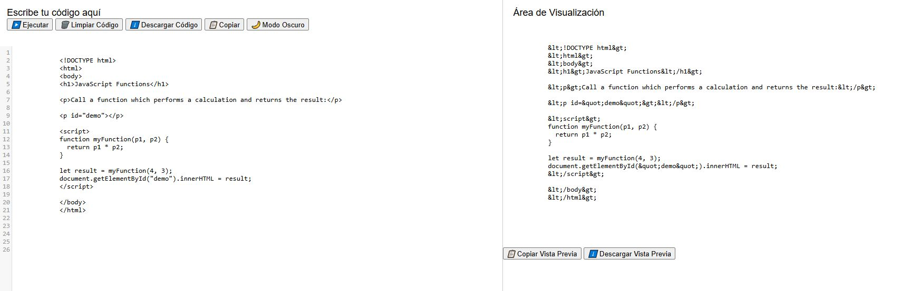

# Editor de Código Interactivo con CodeMirror

## Acceso Rápido a la Aplicación
[HTMLescapado]((https://xococode.github.io/HTMLescapado.github.io/))

## Descripción

Este proyecto es un editor de código interactivo basado en CodeMirror que permite a los usuarios escribir, ejecutar, visualizar y gestionar su código HTML de manera eficiente. La interfaz intuitiva divide la pantalla en dos secciones principales: el editor de código y el área de visualización previa. Además, incluye funcionalidades adicionales como modo oscuro, copiar al portapapeles, descargar código y más.

## Características

- **Editor de Código Integrado**: Utiliza CodeMirror para una experiencia de edición enriquecida con resaltado de sintaxis, numeración de líneas y envoltura de línea.
- **Área de Visualización Previa**: Muestra una vista previa en tiempo real del código HTML ingresado.
- **Botones de Acción**:
  - **Ejecutar**: Actualiza la vista previa con el código actual.
  - **Limpiar Código**: Borra el contenido del editor.
  - **Descargar Código**: Descarga el código HTML como un archivo `.html`.
  - **Copiar**: Copia el contenido del editor al portapapeles.
  - **Modo Oscuro**: Alterna entre el modo claro y oscuro para una mejor experiencia visual.
- **Redimensionamiento Dinámico**: Permite ajustar el tamaño del editor y la vista previa arrastrando el divisor central.
- **Compatibilidad Responsiva**: Se adapta a diferentes tamaños de pantalla para una experiencia óptima en dispositivos móviles y de escritorio.
